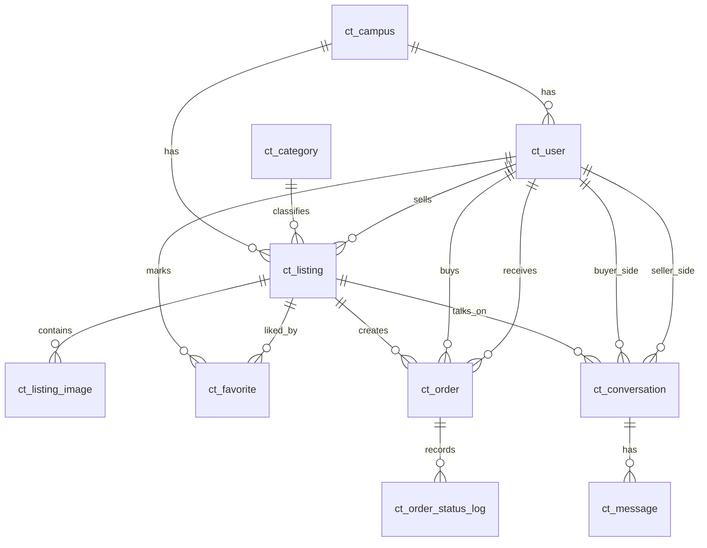

# 校园二手交易平台数据库设计说明

## 1. 设计目标
1. 覆盖当前前端已实现功能：用户认证、商品发布审核、搜索筛选、收藏、订单、消息、后台管理。
2. 支持后续扩展：支付、评价、举报、风控等模块可平滑加表。
3. 保证核心查询性能：商品列表、订单列表、会话列表为高频路径，优先设计索引。

## 2. 设计原则
1. 统一主键：所有业务表采用 `BIGINT UNSIGNED AUTO_INCREMENT`。
2. 软删除策略：用户、商品等核心实体保留 `deleted_at`。
3. 状态机可追溯：订单、商品审核分别保留日志表。
4. 强一致关系：关键业务使用外键，避免脏数据。

## 3. E-R 关系（文本版）
1. `ct_user` 1:N `ct_listing`：一个用户可发布多个商品。
2. `ct_listing` 1:N `ct_listing_image`：一个商品可有多张图片。
3. `ct_user` N:M `ct_listing` 通过 `ct_favorite`：用户可收藏多个商品。
4. `ct_listing` 1:N `ct_order`：同一商品可产生多个订单尝试，最终仅一个完成交易。
5. `ct_order` 1:N `ct_order_status_log`：订单状态流转可追踪。
6. `ct_listing` + `buyer_id` + `seller_id` 唯一确定一个 `ct_conversation`。
7. `ct_conversation` 1:N `ct_message`：会话消息流。

## 4. ER 图（Mermaid）

## 5. 状态字典（建议在后端常量统一维护）
### 5.1 用户状态 `ct_user.user_status`
1. `1`：正常
2. `2`：禁用

### 5.2 商品状态 `ct_listing.listing_status`
1. `0`：草稿
2. `1`：待审核
3. `2`：上架
4. `3`：已售
5. `4`：下架
6. `5`：驳回

### 5.3 订单状态 `ct_order.order_status`
1. `0`：待确认
2. `1`：已确认
3. `2`：进行中
4. `3`：已完成
5. `4`：已取消
6. `5`：已拒绝

## 6. 高频查询与索引策略
1. 商品搜索页：
`ct_listing` 上 `idx_listing_category_status`、`idx_listing_campus_status`、`idx_listing_price`。
2. 我的发布：
`ct_listing` 上 `idx_listing_seller_status`。
3. 我的订单（买家/卖家）：
`ct_order` 上 `idx_order_buyer_status`、`idx_order_seller_status`。
4. 后台审核：
`ct_listing` 上 `idx_listing_status_created`。
5. 聊天会话与消息：
`ct_conversation` 的 `idx_conversation_buyer/seller`，`ct_message` 的 `idx_message_conversation_time`。

## 7. 与现有前端字段映射（关键）
1. 前端 `item.id` -> `ct_listing.listing_id`
2. 前端 `item.images[]` -> `ct_listing_image`
3. 前端 `item.status`（上架/待审核/驳回）-> `ct_listing.listing_status`
4. 前端 `order.id` -> `ct_order.order_no`（展示字段），主键仍为 `order_id`
5. 前端 `chat.messages[]` -> `ct_message`

## 8. 迁移建议
1. 第一阶段：先接用户、商品、审核、订单四大表，满足核心交易闭环。
2. 第二阶段：接会话与消息，实现真实 IM 数据持久化。
3. 第三阶段：补举报、评价、支付流水等扩展表。

## 9. 文件说明
1. 建表脚本见 [schema_mysql.sql](/Users/mac/Downloads/毕设产品说明书/campus-trade-app/docs/database/schema_mysql.sql)。
2. 建议环境：MySQL 8.0+，`utf8mb4` 字符集。
