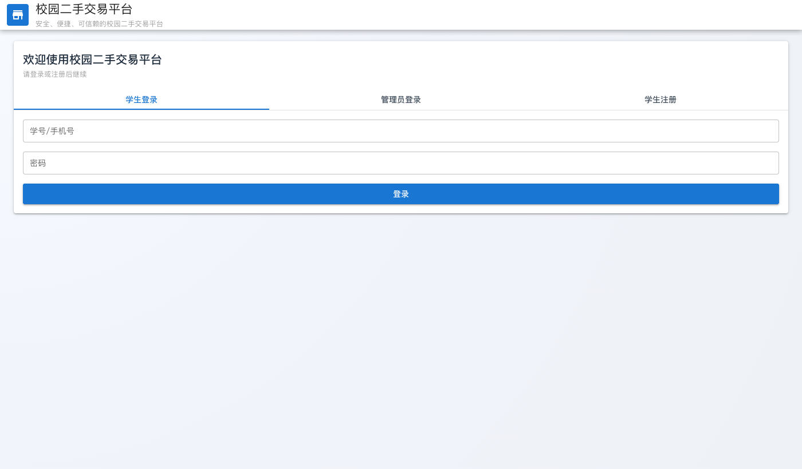
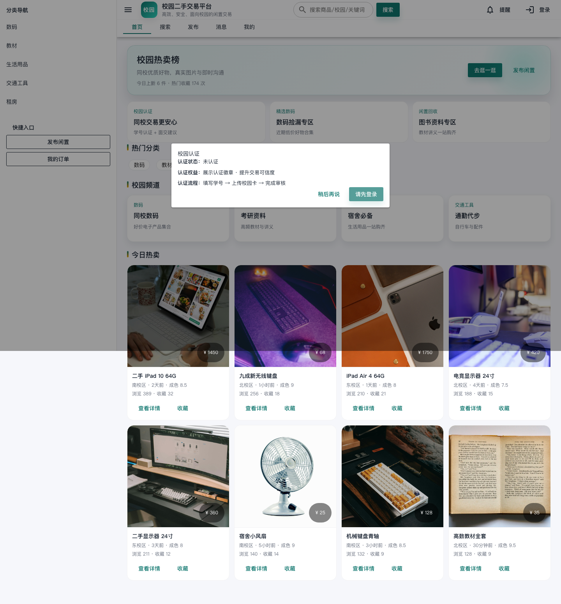
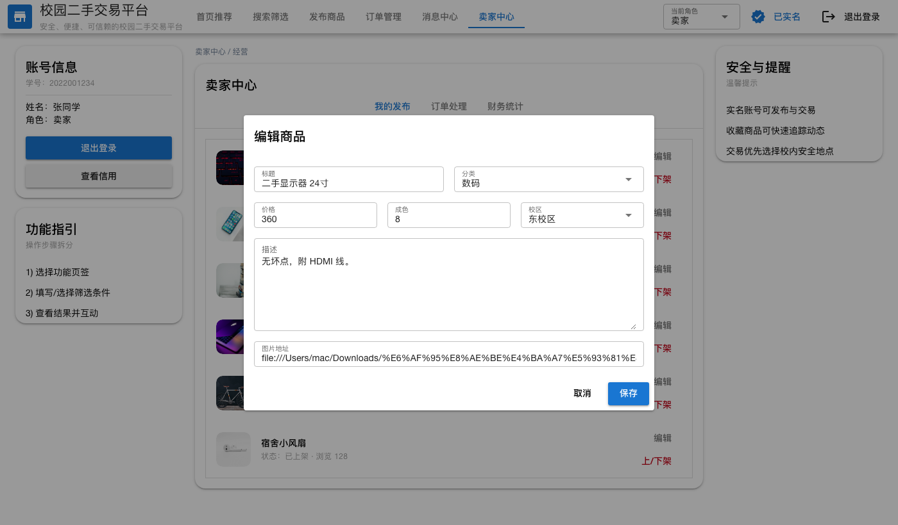
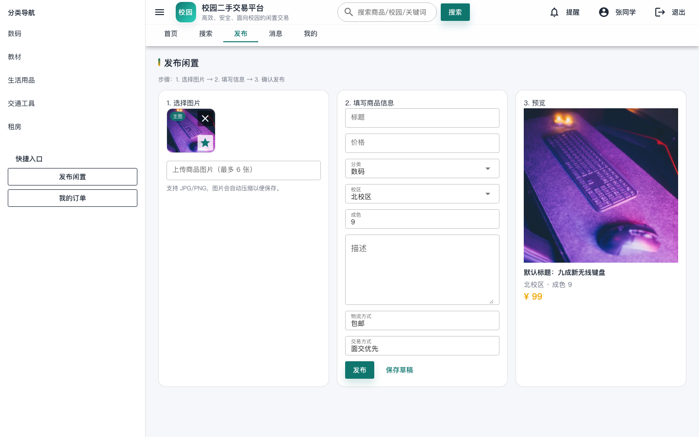
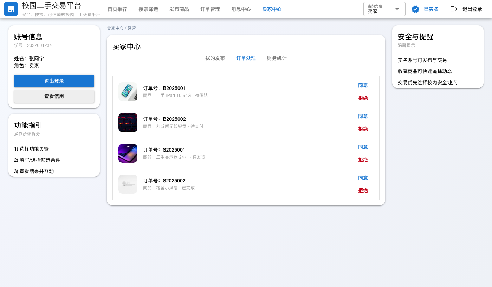
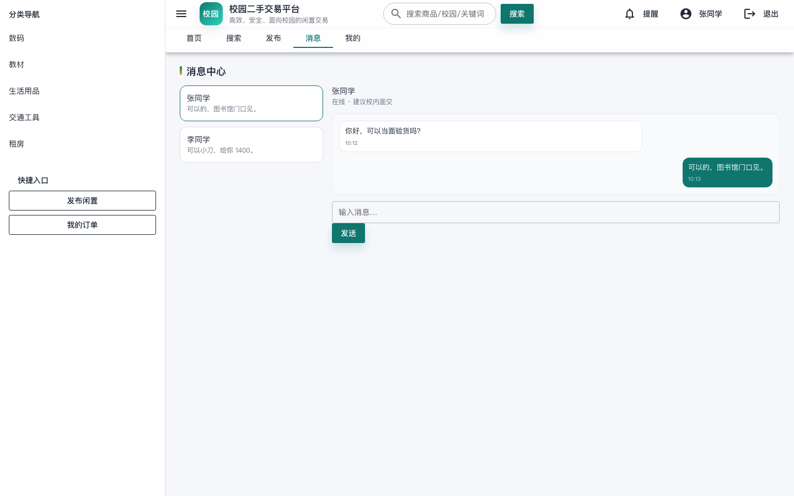
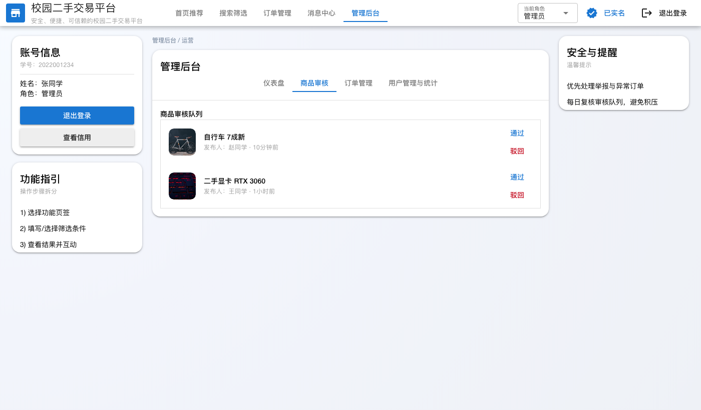
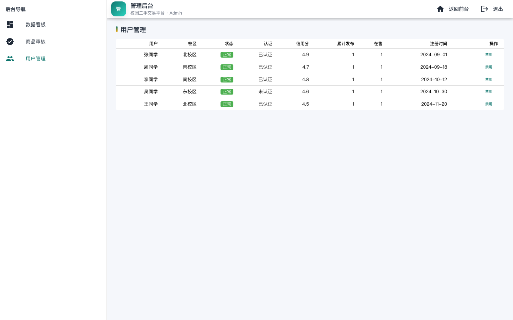

校园二手交易平台
版本号 V1.0
使用说明书
发行单位：苏州城市学院 计算科学与人工智能学院
联系电话：—

目录
1、引言
1.1 引言
1.2 系统功能介绍
2、系统运行需求
2.1 系统运行环境
3、基本操作
3.1 登录与校园认证
3.2 客户端主页
3.3 商品详情与收藏
3.4 买家订单管理
3.5 我的中心（学生身份）
3.6 管理员管理系统

1、引言
1.1 引言
在绿色校园与资源循环利用的背景下，学生闲置物品数量持续增长。线下跳蚤市场、论坛或群聊等方式存在信息碎片化、检索困难、信任机制薄弱等问题，导致供需匹配效率低。校园二手交易平台通过数字化手段整合发布、检索、交易与沟通流程，提供统一的身份认证与信用体系，提升交易效率与安全性，降低多端开发与使用成本。

1.2 系统功能介绍
- 学生/管理员登录与校园认证
- 学生账号同时具备买家与卖家身份
- 首页浏览与分类推荐
- 搜索与多条件筛选
- 商品发布、图片上传与编辑
- 商品详情、收藏与交易安全提示
- 消息沟通与联系方式
- 订单管理（我买到的/我卖掉的）
- “我的”中心：发布、编辑、上下架与收藏
- 管理员审核与用户管理

2、系统运行需求
2.1 系统运行环境
- 终端：Windows 10/11、macOS 或主流 Android/iOS 手机
- 浏览器：Chrome、Edge、Safari（建议使用最新版本）
- 网络：稳定的校园网或移动网络连接
- 其他：建议开启浏览器本地存储权限，用于保存登录状态与偏好

3、基本操作
3.1 登录与校园认证
步骤拆分：
1) 打开平台首页，选择“学生登录”或“管理员登录”。
2) 学生登录后进入首页，可点击“校园认证”完成认证提示。
3) 管理员登录后进入后台管理系统。

图3.1.1 学生登录页面

图3.1.2 管理员登录页面

图3.1.3 校园认证弹窗

3.2 客户端主页
步骤拆分：
1) 登录后进入主页，查看“校园热卖榜”和最新发布。
2) 通过分类标签快速筛选目标品类。
3) 点击商品卡片进入详情页。

图3.2.1 客户端主页

图3.2.3 搜索栏与快捷筛选

3.3 商品详情与收藏
步骤拆分：
1) 在详情页查看商品图片、价格、成色与描述信息。
2) 核对卖家身份与信用评分，必要时点击“私聊”沟通。
3) 点击“收藏”保存商品，关注后续动态。

图3.3 商品详情页面

3.4 订单管理（买家视角）
步骤拆分：
1) 在“订单管理”查看全部订单状态。
2) 对“待确认”订单进行确认或取消。
3) 完成交易后可进行评价，提升信用记录。

图3.4 买家订单管理

3.5 我的中心（学生身份）
学生账号默认具备买卖双重身份，“我的”页面集中展示发布、订单与消息能力。
该模块包含“我发布的、编辑商品、发布新商品、我卖掉的、消息沟通”等部分。

3.5.1 我的发布
步骤拆分：
1) 进入“我的发布”查看已上架商品。
2) 对商品进行编辑、下架或置顶操作。

图3.5.1 我的发布页面

3.5.2 商品编辑
步骤拆分：
1) 点击“编辑”进入编辑表单。
2) 支持替换封面图、上传/移除图片。
3) 更新标题、分类、价格与描述后保存修改。

图3.5.2 商品编辑页面

3.5.3 发布新商品
步骤拆分：
1) 进入发布页填写商品信息与校区。
2) 上传商品图片并设置主图。
3) 点击“发布”，进入平台审核流程后上架。

图3.5.3 发布新商品页面

3.5.4 我卖掉的
步骤拆分：
1) 在订单列表查看买家下单信息与状态。
2) 对待确认订单选择“同意”或“拒绝”。
3) 已确认订单可一键“已发货”，完成交易闭环。

图3.5.4 卖家订单处理页面

3.5.5 消息沟通
步骤拆分：
1) 在消息列表查看与买家的对话记录。
2) 点击会话进入聊天，支持快速回复与交易提醒。

图3.5.5 消息沟通页面

3.6 管理员管理系统
管理员系统包含“仪表盘、商品审核、用户管理”三个模块。

3.6.1 仪表盘
步骤拆分：
1) 登录后台后进入仪表盘查看平台关键指标。
2) 关注活跃用户、成交订单与新增商品数据。

图3.6.1 管理员仪表盘

3.6.2 商品审核
步骤拆分：
1) 在“商品审核”列表查看待审核商品。
2) 对合规商品点击“通过”，违规商品点击“驳回”。

图3.6.2 商品审核页面

3.6.3 用户管理
步骤拆分：
1) 查看用户列表并进行启用/禁用处理。
2) 快速核对注册校区与信用状态。

图3.6.3 用户管理页面

