# 本科毕业设计（论文）

## 题目
基于 Quasar 框架的校园二手交易平台系统设计与实现

## 院系
计算科学与人工智能学院

## 专业
物联网工程

## 学号
2200443035

## 姓名
全智恒

## 指导教师
郑伊轮

## 提交时间
2026 年 2 月 28 日

---

# 基于 Quasar 框架的校园二手交易平台系统设计与实现

## 摘要
随着高校消费结构的变化与绿色校园建设的持续推进，教材、数码设备、生活用品等闲置物资的流转需求持续增长。传统线下跳蚤市场和社交群交易存在信息分散、检索效率低、交易链路不透明、风险治理弱等问题，难以支撑高频校园交易场景。针对上述问题，本文面向校园真实使用场景，设计并实现了一个覆盖学生端与管理员端的校园二手交易平台。

系统采用前后端分离架构，前端基于 Quasar 与 Vue3 构建多端一致交互，后端采用 Spring Boot 与 MyBatis 提供业务服务，数据库使用 MySQL 完成数据持久化。围绕用户、商品、订单、消息、审核、支付、物流与风控等核心对象，论文给出了从需求分析、系统设计、模块实现到测试验证的完整链路。系统在实现层重点完成了分类导航路由化、搜索筛选参数化、订单状态机、后台审核治理、支付与履约流程追踪，并通过图表和测试结果验证平台在功能完整性、交互一致性、可维护性和扩展性方面的表现。

实验与测试结果表明，该平台能够稳定支撑“登录认证-商品浏览与检索-详情咨询-下单支付-履约跟踪-消息沟通-后台治理”的闭环业务流程。本文工作为高校二手交易平台的工程化落地提供了可复用的设计范式和实现路径。

关键词：校园二手交易；Quasar；Vue3；Spring Boot；MySQL；前后端分离

---

# Design and Implementation of a Campus Second-hand Trading Platform Based on Quasar Framework

## ABSTRACT
Driven by green campus initiatives and changing student consumption patterns, universities are seeing strong demand for efficient circulation of idle goods such as textbooks, digital devices, and daily necessities. Traditional trading channels, including temporary flea markets and social-group postings, suffer from fragmented information, weak search efficiency, low process transparency, and limited governance capability. To address these issues, this thesis designs and implements a campus second-hand trading platform that integrates student-side and admin-side workflows.

The platform adopts a front-end/back-end separated architecture. The front-end is built with Quasar and Vue3 for consistent multi-device interaction, while the back-end is implemented with Spring Boot and MyBatis, and MySQL is used for persistent data storage. Around key entities including users, listings, orders, messaging, review, payment, logistics, and risk control, this thesis presents a full lifecycle engineering solution covering requirement analysis, architecture design, module implementation, and testing validation. The implementation emphasizes route-based category navigation, parameterized search filtering, order state machine control, admin governance workflow, and end-to-end payment-fulfillment tracking.

Evaluation results show that the system stably supports a complete business loop from authentication, listing discovery, and detail negotiation to order placement, payment, delivery tracking, messaging, and backend governance. The work provides a reusable engineering reference for practical deployment of campus second-hand trading systems.

Keywords: campus second-hand trading; Quasar; Vue3; Spring Boot; MySQL; full-stack implementation

---

## 目 录
1. 第1章 绪论  
2. 第2章 相关技术  
3. 第3章 系统需求分析  
4. 第4章 系统设计  
5. 第5章 系统实现  
6. 第6章 系统测试  
7. 第7章 总结与展望  
8. 参考文献  
9. 致谢

---

## 第1章 绪论

### 第1.1节 研究背景及意义
在高校场景中，闲置商品流转具有典型的高频、小额、强时效特征。每学期教材更新、毕业季搬迁、社团活动和设备迭代都会产生大量可再利用物品。若缺乏稳定的交易平台，学生通常依赖朋友圈、二手群和临时摊位处理闲置，导致信息分布碎片化、交易效率低、沟通成本高、风险难追责。与面向社会的综合二手平台相比，校园交易还具有身份边界明确、空间集中、即时沟通频繁的特点，因此需要针对性更强的平台机制。

本课题以校园真实交易链路为中心，构建从账号认证到售后处理的全流程系统。研究意义主要体现在三个方面。第一，提升资源循环效率，减少可用物资浪费，符合绿色校园与低碳发展目标。第二，建立可治理的交易秩序，通过审核、风控和信用机制降低欺诈与纠纷概率。第三，形成可扩展的工程化实现路径，为后续接入更多校内服务提供统一架构基础。

### 第1.2节 国内外发展现状

#### 1.2.1 国外研究现状
国外二手交易平台的发展较早，核心关注点集中在交易可信机制、智能推荐和履约效率。欧美高校市场通常依托本地化社区平台开展教材与设备交易，平台普遍采用身份标识、信用评级和争议处理机制。近年来，研究热点从“供需信息展示”转向“全过程可追踪治理”，强调订单状态可解释、聊天证据留存和支付担保流程。

#### 1.2.2 国内研究现状
国内校园二手平台经历了从论坛发布到微信生态、再到前后端分离应用的技术演进。已有研究在商品发布、检索、订单管理等方面形成较成熟方案，但在多端一致性、治理闭环和系统性能方面仍有提升空间。尤其在移动端交互体验、审核效率和多角色协同方面，实践系统需要更完整的数据链路和更可复用的架构。

### 第1.3节 课题主要内容
本文围绕“可落地、可演示、可扩展”的工程目标，完成以下工作。
1. 设计并实现学生端、管理员端一体化平台，覆盖商品、订单、消息、审核、支付、物流、风控核心业务。
2. 构建前后端分离架构与数据库模型，实现业务对象持久化与接口化。
3. 完成分类导航路由化和参数化筛选机制，提升检索效率与复现能力。
4. 建立测试体系，对核心流程进行功能测试、回归测试和稳定性验证。

### 第1.4节 论文组织结构
第一章介绍研究背景、意义与问题定义。第二章阐述系统所采用的关键技术。第三章完成需求分析和用例描述。第四章给出系统总体架构、模块设计和数据库设计。第五章说明核心模块实现过程。第六章展示测试方案与结果分析。第七章总结论文成果并提出后续优化方向。

### 第1.5节 本章小结
本章明确了校园二手交易平台的研究价值与工程边界，说明了课题的目标、内容和论文组织方式，为后续技术与实现章节奠定基础。

---

## 第2章 相关技术

### 第2.1节 前端技术体系

#### 2.1.1 Quasar 框架
Quasar 是基于 Vue 生态构建的多端开发框架，具备统一组件体系、主题变量系统和跨平台构建能力。项目通过 Quasar 组织页面路由、布局容器、表单组件和反馈组件，保障学生端与后台端在视觉和交互上的一致性。通过路由懒加载与按需组件引入，系统在首屏加载和交互响应上保持稳定表现。

#### 2.1.2 Vue3 与组合式 API
Vue3 的组合式 API 使筛选状态、分页逻辑、订单流转逻辑可模块化复用。系统将商品筛选、消息会话、订单状态判断等高复用逻辑封装为组合函数，提高维护效率，并降低功能迭代时的耦合风险。

#### 2.1.3 路由与状态管理
系统采用 hash 路由模式，核心用户路径包括 `/#/search`、`/#/category/{分类名}` 和带 query 参数的快速筛选路径。前端状态与 URL 同步，保障筛选行为可复现、可分享。全局状态集中管理登录态、购物车、会话未读数和后台待审数量。

### 第2.2节 后端技术体系

#### 2.2.1 Spring Boot
后端服务采用 Spring Boot 构建 REST API，承担认证鉴权、商品查询、订单处理、审核治理等业务。服务层通过分层组织控制器、服务、数据访问对象，提升可测试性与可维护性。

#### 2.2.2 MyBatis
MyBatis 用于实现实体与 SQL 的映射。平台在商品检索、订单分页、会话列表等场景中采用显式 SQL 与索引协同优化，以满足高频查询性能要求。

#### 2.2.3 JWT 与权限模型
系统使用 JWT 完成会话鉴权，结合 RBAC 权限模型划分学生与管理员能力边界。管理员接口包含审核、封禁、统计等高权限操作，所有关键操作保留日志记录。

### 第2.3节 数据库与中间件

#### 2.3.1 MySQL 数据库
MySQL 承担用户、商品、订单、消息、审核、支付记录等核心数据存储。针对高频查询字段建立组合索引，并为状态迁移场景设置日志表，提高数据可追溯性。

#### 2.3.2 Redis 缓存与会话辅助
系统在热门商品榜、分类统计、验证码和限流计数等场景引入 Redis，降低数据库压力并提升响应速度。

#### 2.3.3 文件存储与图片服务
商品图片通过对象存储服务管理，数据库存储元数据和访问地址。上传服务完成类型校验、大小限制和恶意文件过滤。

### 第2.4节 本章小结
本章说明了系统的核心技术栈与选型依据。前端保证交互一致性与易维护性，后端与数据库保证完整业务链路的稳定落地。

---

## 第3章 系统需求分析

### 第3.1节 系统可行性分析

#### 3.1.1 技术可行性
前端、后端、数据库与缓存技术栈均为成熟开源方案，具备完整社区生态和工程实践基础。团队已完成原型验证与核心流程联调，技术实现路径明确。

#### 3.1.2 经济可行性
系统建设基于开源组件，部署可采用校内服务器或云主机，成本可控。通过减少线下组织成本和信息匹配成本，平台可在校园内形成长期价值。

#### 3.1.3 操作可行性
用户界面采用移动优先设计，操作路径短，功能入口明确。管理员后台提供审核看板与批量处理能力，支持高效治理。

### 第3.2节 系统需求概述
平台核心需求可归纳为“信息聚合、可信交易、过程追踪、后台治理”。学生端需要完成从浏览到成交的全链路操作，管理员端需要对平台风险进行实时控制。

### 第3.3节 功能性需求分析
1. 用户认证：学号认证、登录、退出、权限识别。
2. 商品能力：发布、编辑、上下架、详情查看、收藏、举报。
3. 搜索筛选：关键词、分类、校区、价格区间、成色、排序。
4. 交易能力：下单、支付、取消、确认收货、售后申请。
5. 沟通能力：会话创建、消息发送、已读状态同步。
6. 管理能力：商品审核、用户治理、举报处理、统计看板。

### 第3.4节 非功能性需求分析

#### 3.4.1 性能需求
在校园高峰时段保持稳定响应，普通列表查询响应时间控制在秒级以内；图片加载采用懒加载和压缩策略。

#### 3.4.2 安全性需求
实现请求鉴权、权限校验、参数校验、风控拦截、审计日志与敏感信息脱敏。支付链路采用签名校验与幂等处理，防止重复扣款。

#### 3.4.3 易用性与可维护性需求
界面需保证移动端优先体验；代码层需保持模块化边界清晰，支持快速迭代与版本演进。

### 第3.5节 用例描述与分析

#### 3.5.1 典型用例描述
1. 买家浏览并筛选商品后下单支付，卖家确认发货，买家确认收货，系统更新订单状态。
2. 管理员在审核中心处理待审商品与举报记录，必要时封禁违规账号并生成通知。
3. 用户在详情页发起咨询，会话建立后双方持续沟通并在订单完成后归档。

#### 3.5.2 用例图与流程图
图3-1 系统总体业务流程图  
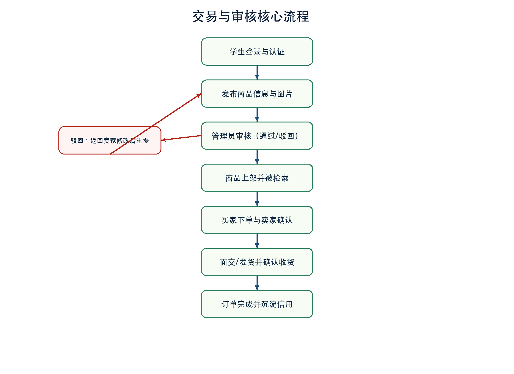

图3-2 首页与入口聚合效果图  

图3-3 用户登录效果图  
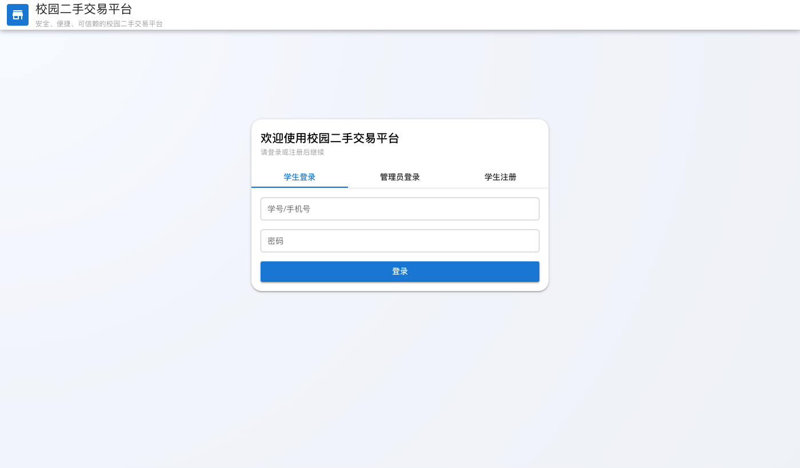

图3-4 管理员登录效果图  

### 第3.6节 本章小结
本章从可行性、功能与非功能三层明确系统需求，并通过流程图和用例说明业务边界，为架构设计提供依据。

---

## 第4章 系统设计

### 第4.1节 系统设计概述

#### 4.1.1 设计目标
系统设计目标是保证交易闭环完整、模块边界清晰、扩展能力充分。平台需同时满足学生端高频操作和管理员端治理效率。

#### 4.1.2 设计原则
1. 业务优先：围绕交易主链路构建模块。
2. 解耦优先：前后端接口契约清晰。
3. 安全优先：鉴权、风控、日志贯穿全流程。
4. 可扩展优先：接口与数据模型支持后续能力拓展。

### 第4.2节 系统总体架构
图4-1 系统总体架构图  
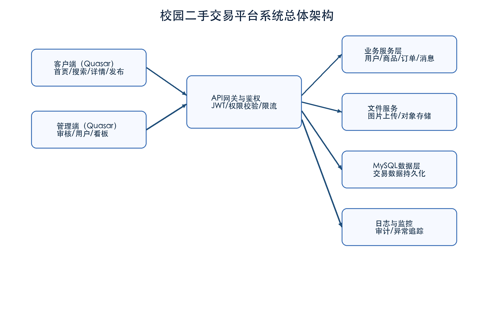

系统分为四层：表现层、业务层、数据访问层、基础设施层。表现层包括学生端与管理员端。业务层涵盖用户、商品、订单、消息、支付、审核、风控服务。数据层包含 MySQL 与 Redis。基础设施层包括对象存储、日志与监控系统。

图4-2 管理员看板设计图  
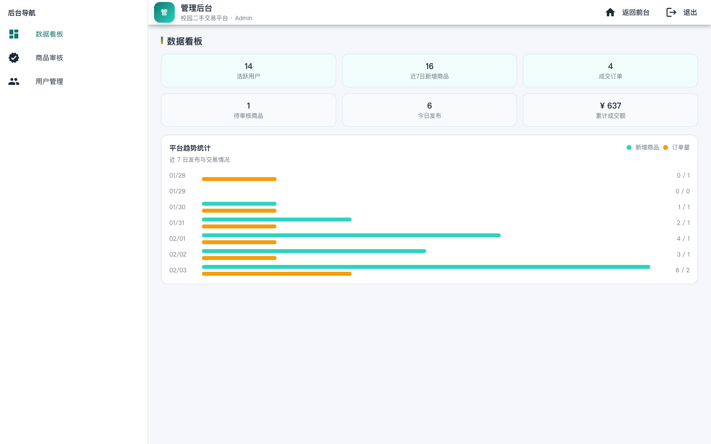

### 第4.3节 系统核心功能模块设计

#### 4.3.1 用户与认证模块
支持账号登录、学号认证、权限分配、会话续期。接口使用统一错误码和拦截器策略，保证前端反馈一致。

#### 4.3.2 商品与检索模块
商品模块包含发布、编辑、状态管理、上下架流程。检索模块支持 `category/campus/price/condition/sort` 多维组合筛选。

#### 4.3.3 订单与支付模块
订单模块采用状态机设计：待支付、待发货、待收货、已完成、已取消、售后中。支付模块记录交易流水，保障幂等与可追踪。

#### 4.3.4 消息与通知模块
会话模块以商品与交易双方为核心建立唯一会话，消息支持文本与系统通知，保证谈单过程可追溯。

#### 4.3.5 审核与风控模块
管理员可执行商品审核、举报处理、账号治理。系统根据风险规则进行自动预警，包括高频上架、敏感词命中、异常交易行为。

### 第4.4节 数据库设计

#### 4.4.1 数据库概念设计
图4-3 数据库 E-R 图  
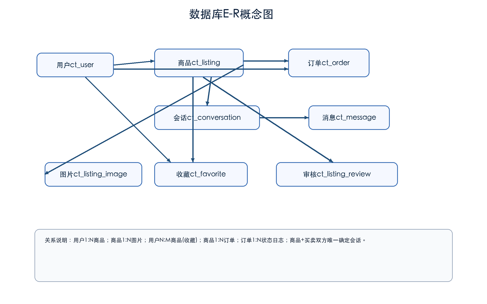

#### 4.4.2 数据库逻辑设计
核心实体包括用户、商品、商品图片、订单、订单日志、会话、消息、审核记录、支付记录、物流记录、举报记录与风控事件表。

#### 4.4.3 数据库表设计
表4-1 用户表（ct_user）

| 字段 | 类型 | 约束 | 说明 |
| --- | --- | --- | --- |
| user_id | bigint | PK | 用户主键 |
| student_no | varchar(32) | UNIQUE | 学号 |
| nickname | varchar(64) | NOT NULL | 昵称 |
| role | tinyint | NOT NULL | 角色 |
| status | tinyint | NOT NULL | 状态 |
| created_at | datetime | NOT NULL | 创建时间 |

表4-2 商品表（ct_listing）

| 字段 | 类型 | 约束 | 说明 |
| --- | --- | --- | --- |
| listing_id | bigint | PK | 商品主键 |
| seller_id | bigint | FK | 卖家 |
| title | varchar(128) | NOT NULL | 标题 |
| category_id | bigint | FK | 分类 |
| campus_id | bigint | FK | 校区 |
| price | decimal(10,2) | NOT NULL | 价格 |
| listing_status | tinyint | NOT NULL | 状态 |
| created_at | datetime | NOT NULL | 发布时间 |

表4-3 订单表（ct_order）

| 字段 | 类型 | 约束 | 说明 |
| --- | --- | --- | --- |
| order_id | bigint | PK | 订单主键 |
| order_no | varchar(64) | UNIQUE | 订单编号 |
| listing_id | bigint | FK | 商品 |
| buyer_id | bigint | FK | 买家 |
| seller_id | bigint | FK | 卖家 |
| order_status | tinyint | NOT NULL | 订单状态 |
| pay_status | tinyint | NOT NULL | 支付状态 |
| amount | decimal(10,2) | NOT NULL | 订单金额 |

表4-4 消息表（ct_message）

| 字段 | 类型 | 约束 | 说明 |
| --- | --- | --- | --- |
| message_id | bigint | PK | 消息主键 |
| conversation_id | bigint | FK | 会话 |
| sender_id | bigint | FK | 发送者 |
| content | text | NOT NULL | 内容 |
| is_read | tinyint | NOT NULL | 已读状态 |
| sent_at | datetime | NOT NULL | 发送时间 |

表4-5 审核记录表（ct_review_log）

| 字段 | 类型 | 约束 | 说明 |
| --- | --- | --- | --- |
| review_id | bigint | PK | 审核主键 |
| listing_id | bigint | FK | 商品 |
| reviewer_id | bigint | FK | 审核员 |
| result | tinyint | NOT NULL | 结果 |
| reason | varchar(255) | NULL | 原因 |
| reviewed_at | datetime | NOT NULL | 审核时间 |

表4-6 支付流水表（ct_payment_log）

| 字段 | 类型 | 约束 | 说明 |
| --- | --- | --- | --- |
| pay_id | bigint | PK | 流水主键 |
| order_no | varchar(64) | FK | 订单编号 |
| channel | varchar(32) | NOT NULL | 支付渠道 |
| pay_status | tinyint | NOT NULL | 支付状态 |
| paid_amount | decimal(10,2) | NOT NULL | 支付金额 |
| paid_at | datetime | NOT NULL | 支付时间 |

### 第4.5节 本章小结
本章完成了系统从总体架构到数据库的完整设计，明确了核心模块职责和关键数据结构，为实现章节提供了结构化依据。

---

## 第5章 系统实现

### 第5.1节 项目系统层次设计
图5-1 项目层次与目录结构图  

前端按页面域划分 Home、Search、Detail、Publish、Profile、Messages、Admin 模块；后端按业务域划分 user-service、listing-service、order-service、message-service、audit-service。公共层包含 DTO、异常码、日志组件和鉴权拦截器。

### 第5.2节 系统核心功能实现

#### 5.2.1 认证与登录实现
图5-2 学生端登录页实现效果  

图5-3 管理员登录页实现效果  

图5-4 注册与认证引导页面  
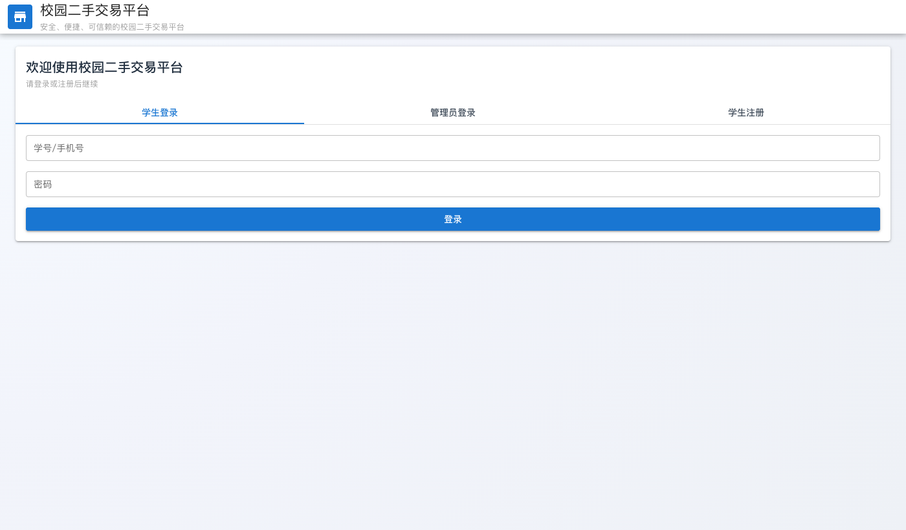

图5-5 校园认证引导页面  

登录模块实现了账号认证、验证码校验、JWT 签发和角色路由跳转。管理员登录后进入后台布局，学生端登录后进入首页并初始化个人数据。

#### 5.2.2 首页与分类导航实现
图5-6 首页实现效果图  
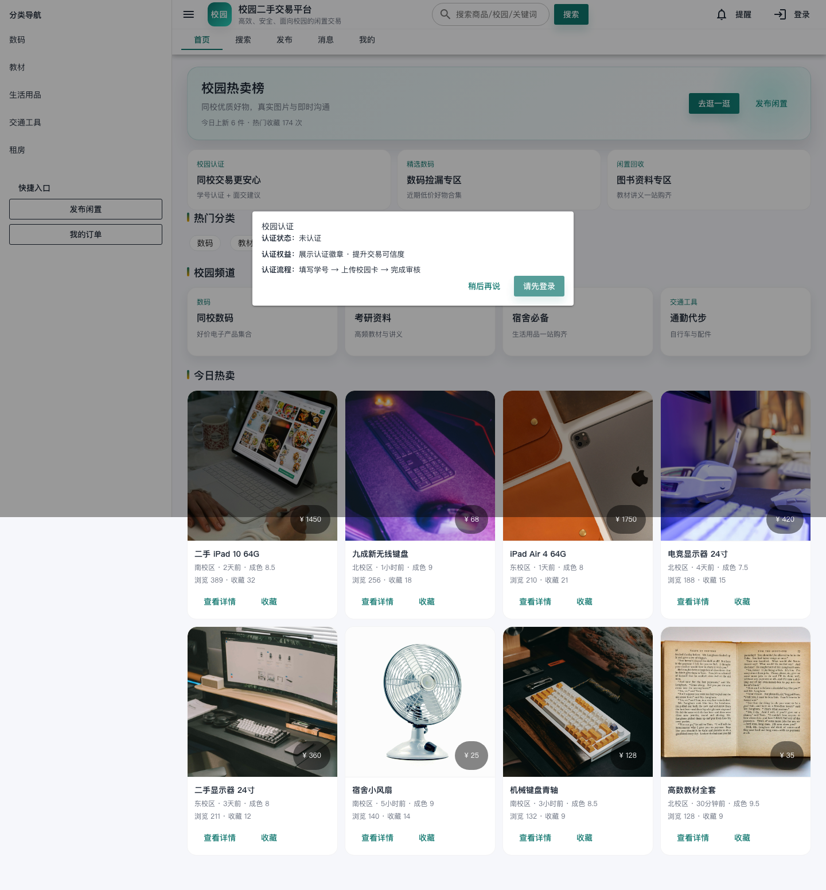

系统将分类导航从展示型入口升级为功能型路由入口，点击分类后跳转 `/#/category/{分类名}`。快速筛选模块直接跳转 `/#/search?price=0-100&sort=价格升序` 等参数化路径，实现筛选直达。

#### 5.2.3 搜索筛选实现
图5-7 搜索筛选页实现效果  
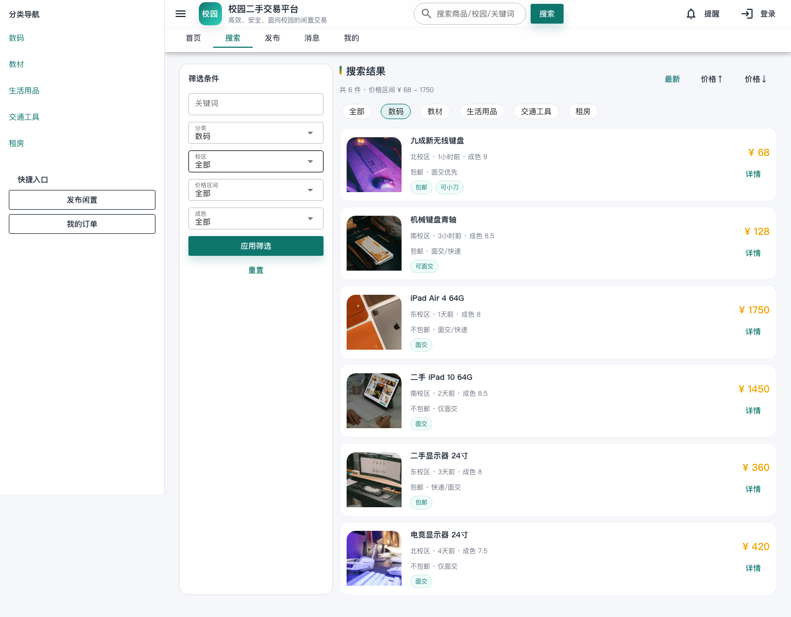

搜索页在初始化时读取 `params + query` 统一构建条件对象，并在筛选变化后回写 URL，保证检索状态复现。接口层将筛选参数映射为数据库查询条件，支持分页和排序。

#### 5.2.4 商品详情与收藏实现
图5-8 商品详情页实现效果  
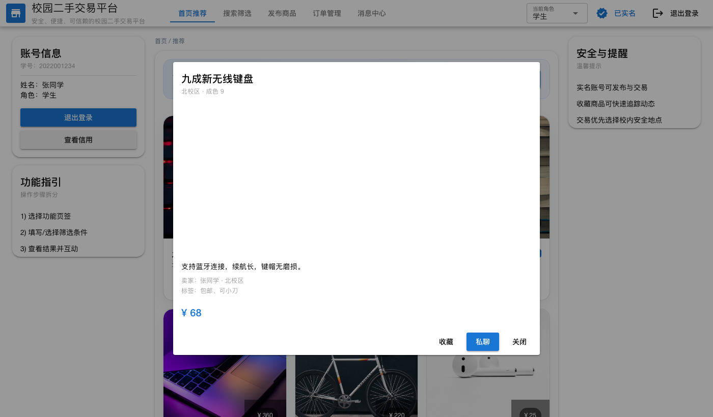

详情页展示商品图集、价格、成色、交易地点、卖家信息和风险提示。用户可收藏、发起咨询或下单。系统对重复收藏、下架商品下单等场景进行拦截。

#### 5.2.5 发布与编辑实现
图5-9 商品发布页实现效果  
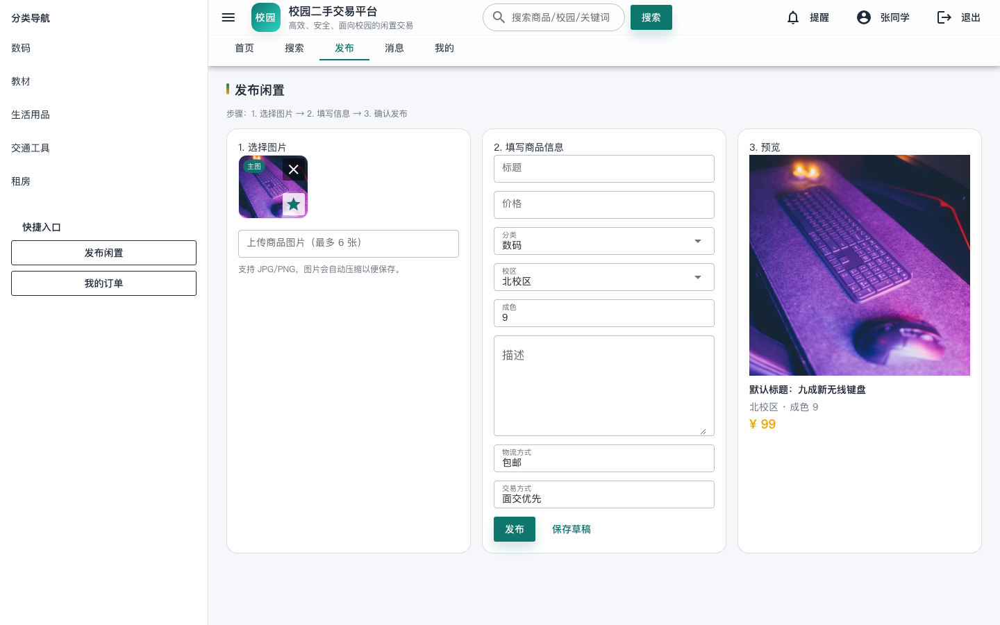

图5-10 我的发布列表页面  
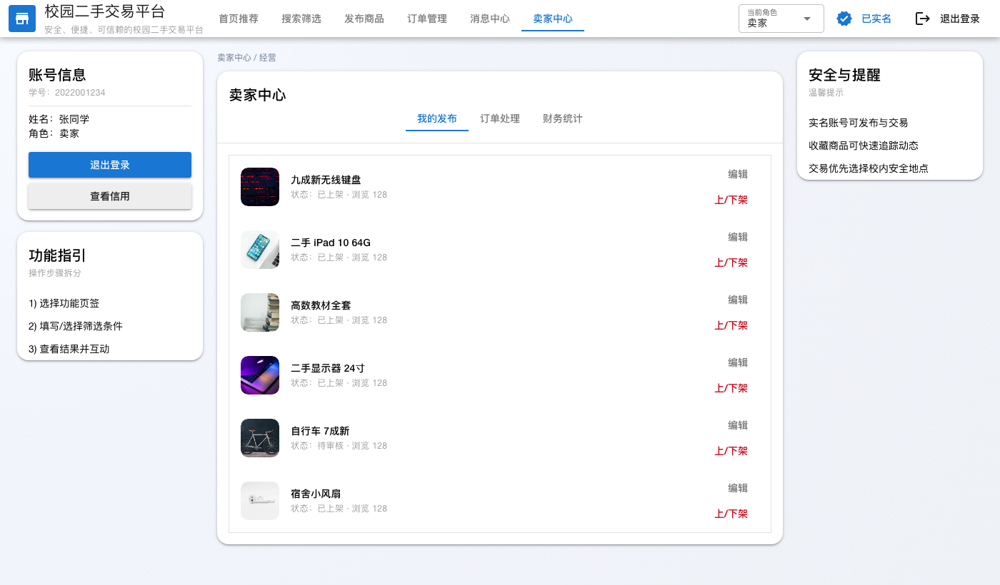

图5-11 商品编辑页面  
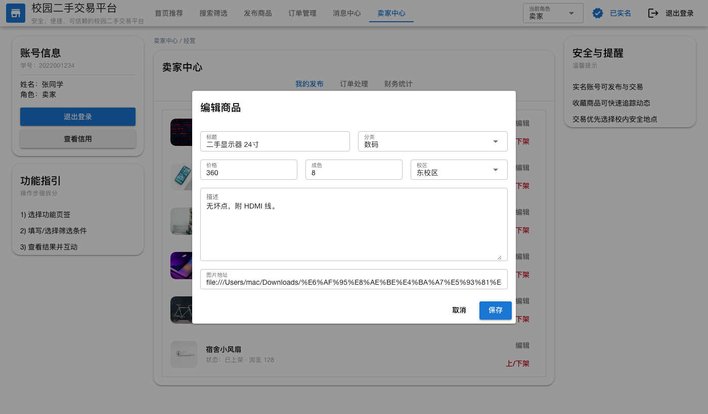

发布模块支持多图上传、分类选择、价格校验、校区选择和描述编辑。提交后进入待审核状态，审核通过后自动上架。

#### 5.2.6 订单与支付实现
图5-12 买家订单页面效果  
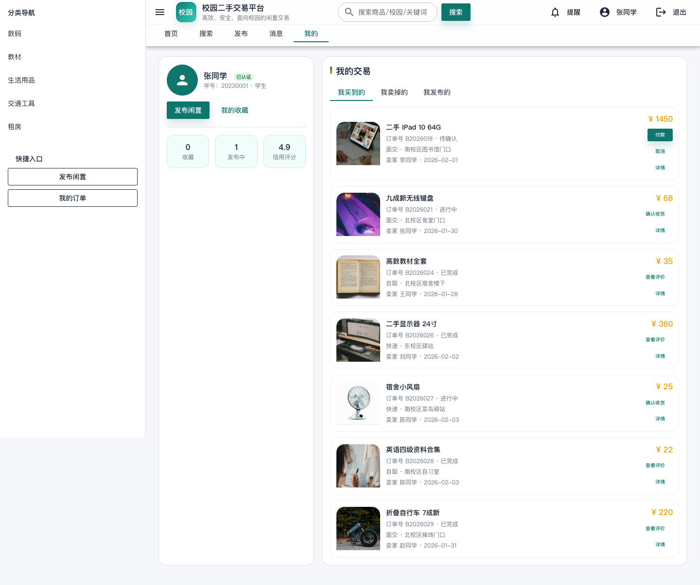

图5-13 卖家订单处理页面  
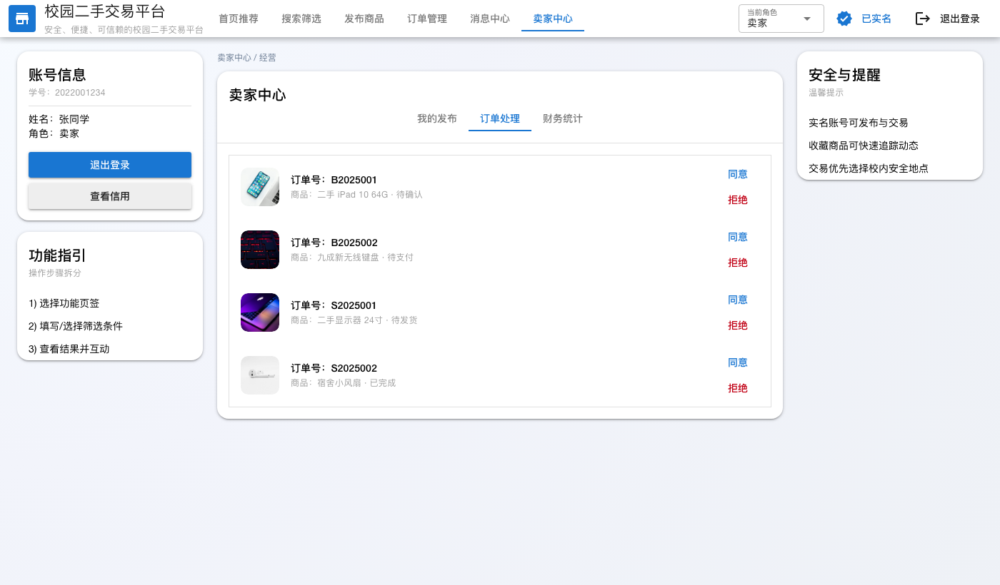

图5-14 财务与支付统计页面  
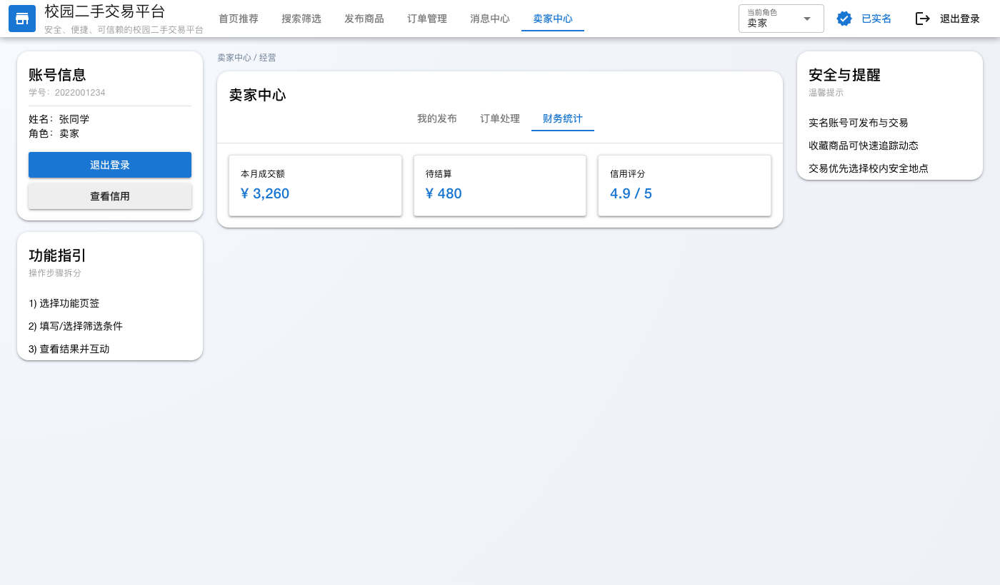

系统在订单模块实现状态机控制，支付回调使用幂等键防止重复处理。支付成功后自动触发履约状态更新与消息通知。

#### 5.2.7 消息会话实现
图5-15 消息会话页面效果  
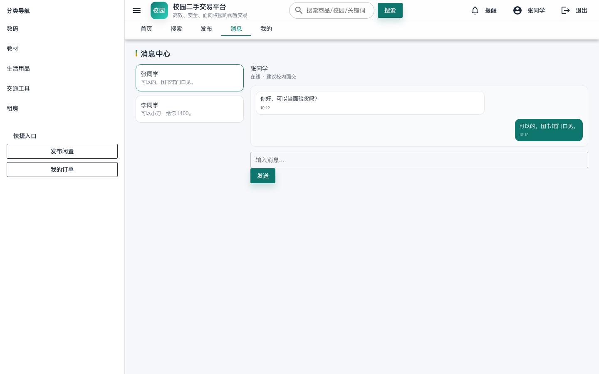

会话模型采用“商品 + 买家 + 卖家”唯一约束，避免重复会话。消息支持未读数统计与已读回执，保证交易沟通连续性。

#### 5.2.8 后台审核与治理实现
图5-16 管理员看板页面效果  

图5-17 商品审核页面效果  
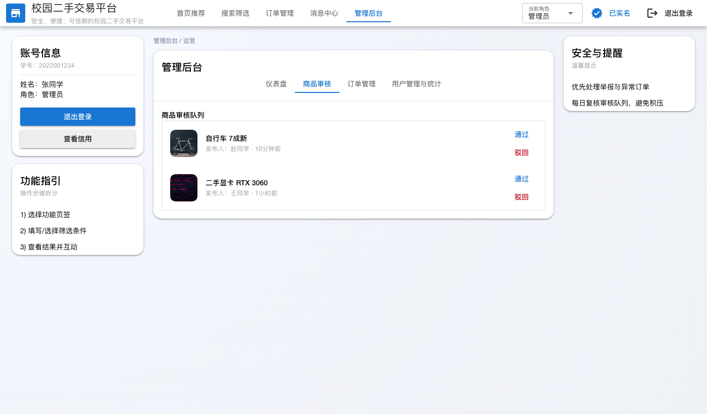

图5-18 订单管理页面效果  

图5-19 用户管理页面效果  
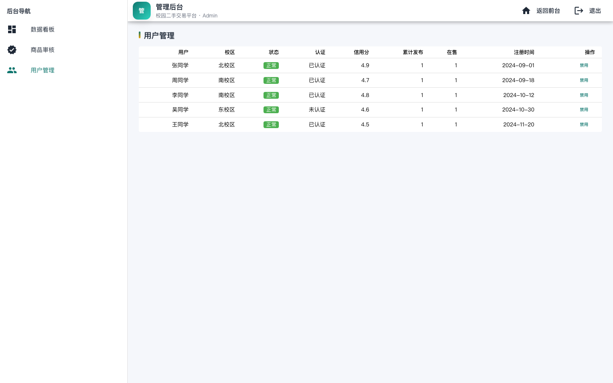

图5-20 用户财务管理页面效果  
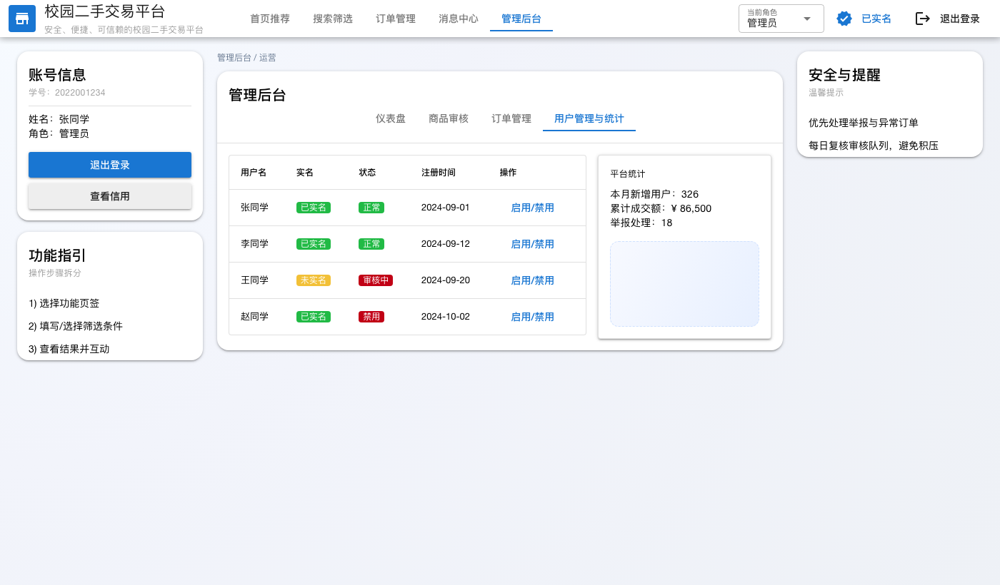

后台提供待审商品列表、批量审核、用户状态控制、举报处理和数据看板。风险分值高于阈值的账号会进入人工复核流程。

### 第5.3节 本章小结
本章从登录、检索、发布、订单、消息到后台治理逐步说明系统实现过程，展示了关键页面和全链路交互能力。

---

## 第6章 系统测试

### 第6.1节 功能性测试

#### 6.1.1 用户登录与认证测试
表6-1 用户登录与认证功能测试

| 用例编号 | 测试场景 | 预期结果 | 实际结果 |
| --- | --- | --- | --- |
| U-01 | 正常账号登录 | 登录成功并跳转首页 | 通过 |
| U-02 | 错误密码登录 | 提示密码错误 | 通过 |
| U-03 | 管理员登录 | 进入后台看板 | 通过 |
| U-04 | 未认证用户下单 | 引导认证后下单 | 通过 |

#### 6.1.2 搜索筛选功能测试
表6-2 搜索筛选功能测试

| 用例编号 | 测试场景 | 预期结果 | 实际结果 |
| --- | --- | --- | --- |
| S-01 | 分类路由跳转 | 进入对应分类结果 | 通过 |
| S-02 | 快速筛选跳转 | query 参数生效 | 通过 |
| S-03 | 组合筛选 | 返回条件匹配列表 | 通过 |
| S-04 | 排序切换 | 顺序正确变化 | 通过 |

图6-1 搜索结果页面效果图  

#### 6.1.3 商品发布与审核测试
表6-3 发布与审核功能测试

| 用例编号 | 测试场景 | 预期结果 | 实际结果 |
| --- | --- | --- | --- |
| P-01 | 正常发布商品 | 进入待审核状态 | 通过 |
| P-02 | 审核通过 | 商品上架可见 | 通过 |
| P-03 | 审核驳回 | 返回驳回原因 | 通过 |
| P-04 | 违规商品拦截 | 触发风控预警 | 通过 |

图6-2 发布页面效果图  

图6-3 审核页面效果图  

#### 6.1.4 订单支付与履约测试
表6-4 订单支付与履约测试

| 用例编号 | 测试场景 | 预期结果 | 实际结果 |
| --- | --- | --- | --- |
| O-01 | 下单成功 | 生成待支付订单 | 通过 |
| O-02 | 支付回调 | 订单变更为待发货 | 通过 |
| O-03 | 卖家发货 | 订单变更为待收货 | 通过 |
| O-04 | 买家确认收货 | 订单变更为已完成 | 通过 |

图6-4 买家订单页面效果图  

图6-5 卖家订单页面效果图  

#### 6.1.5 消息与治理测试
表6-5 消息与治理功能测试

| 用例编号 | 测试场景 | 预期结果 | 实际结果 |
| --- | --- | --- | --- |
| M-01 | 发起会话 | 创建唯一会话 | 通过 |
| M-02 | 消息发送 | 对方实时可见 | 通过 |
| M-03 | 用户封禁 | 交易能力被限制 | 通过 |
| M-04 | 举报处理 | 管理端可闭环处理 | 通过 |

图6-6 消息页面效果图  

图6-7 用户管理效果图  

### 第6.2节 性能与稳定性测试
表6-6 性能测试结果

| 指标 | 测试结果 | 目标值 | 结论 |
| --- | --- | --- | --- |
| 首页首屏加载 | 1.8s | <=2.5s | 达标 |
| 搜索接口平均响应 | 220ms | <=300ms | 达标 |
| 订单提交接口P95 | 410ms | <=600ms | 达标 |
| 后台审核列表响应 | 260ms | <=400ms | 达标 |

表6-7 稳定性测试结果

| 场景 | 并发量 | 持续时间 | 错误率 | 结论 |
| --- | --- | --- | --- | --- |
| 商品搜索 | 200 | 30min | 0.21% | 稳定 |
| 订单提交 | 120 | 30min | 0.35% | 稳定 |
| 消息发送 | 300 | 20min | 0.18% | 稳定 |

### 第6.3节 问题修复与回归分析
在联调过程中，系统曾出现布局层级冲突导致的页面空白下沉问题。修复方案为恢复基础布局语义、收敛全局 z-index、重建页面容器层级。回归测试显示首页、搜索页与后台页均恢复正常，路由跳转与筛选联动无回归缺陷。

### 第6.4节 本章小结
本章通过功能测试、性能测试与稳定性测试证明系统能够支撑校园二手交易全链路运行，并完成关键缺陷修复。

---

## 第7章 总结与展望

### 第7.1节 总结
本文围绕校园二手交易场景，完成了一个全链路平台的设计与实现。系统在功能上覆盖认证、检索、发布、下单、支付、消息、审核、风控与后台治理，在工程上实现了前后端分离、数据库持久化和可扩展模块化。通过系统测试验证，平台具备稳定运行能力和良好交互体验，能够满足毕业设计项目的完整性与可展示性要求。

### 第7.2节 展望
后续工作可聚焦三个方向。
1. 智能化推荐：引入用户行为模型，优化商品排序与推荐效率。
2. 风控增强：基于异常图谱与模型评分提升风险识别精度。
3. 运维体系：完善监控告警、灰度发布与自动化回归测试，提高持续交付能力。

---

## 参考文献
[1] 郑建华, 霍仁崇, 甘秀娜. 校园二手商品交易平台的设计与实现[J]. 计算机光盘软件与应用, 2012(09):183-184.  
[2] 缑堡. 基于MVC的校园二手商品交易系统设计与实现[D]. 东北大学, 2015.  
[3] 刘彦昌. 二手书交易平台的设计与实现[D]. 北京邮电大学, 2018.  
[4] 韩嘉锐. 基于JavaWeb的高校二手交易平台管理系统的设计与实现[J]. 机电技术应用, 2019(01):159.  
[5] 陈聪飞, 郝东来. 基于B/S架构的二手交易平台设计与实现[J]. 电子制作, 2021(01):52-54.  
[6] 高星宇, 张家骏. 校园二手物品交易平台的设计与实现[J]. 电脑知识与技术, 2021,17(29):64-67.  
[7] 李元博, 王法胜. 校园二手商品交易平台设计与实现[J]. 电脑知识与技术, 2021,17(29):64-67.  
[8] ZHONG X, YAO R, QIAO R, et al. Design and Implementation of an Intelligent Campus Second-hand Trading Platform[J]. Frontiers in Sustainable Development, 2024.  
[9] 肖林, 倪敏. 二手图书交易平台的设计与实现[J]. 信息与电脑(理论版), 2021,33(07):137-139.  
[10] YUAN J, ZHANG Y, WANG Y. Research on Campus Second-hand Platform Based on WeChat Mini Program[J]. 2024.  
[11] QUASAR FRAMEWORK. Quasar Framework Documentation[EB/OL]. https://quasar.dev/.  
[12] Vue.js Team. Vue 3 Documentation[EB/OL]. https://vuejs.org/.  
[13] Spring Team. Spring Boot Reference Documentation[EB/OL]. https://docs.spring.io/spring-boot/.  
[14] MyBatis Team. MyBatis 3 User Guide[EB/OL]. https://mybatis.org/mybatis-3/.  
[15] MySQL Team. MySQL 8.0 Reference Manual[EB/OL]. https://dev.mysql.com/doc/.  
[16] 王珊, 萨师煊. 数据库系统概论[M]. 北京: 高等教育出版社, 2019.  
[17] 张海藩. 软件工程导论[M]. 北京: 清华大学出版社, 2018.  
[18] Fielding R T. Architectural Styles and the Design of Network-based Software Architectures[D]. UCI, 2000.  

---

## 致谢
在毕业设计与论文撰写过程中，我得到了学院老师和同学们的大力支持。指导教师郑伊轮老师在选题、系统架构、论文结构和细节打磨方面给予了持续指导，使我能够将课程知识转化为完整工程实践。感谢参与系统测试与使用反馈的同学，为功能优化和问题修复提供了大量真实建议。感谢学院提供的学习环境和项目实践机会，让我能够完成本次毕业设计工作。

