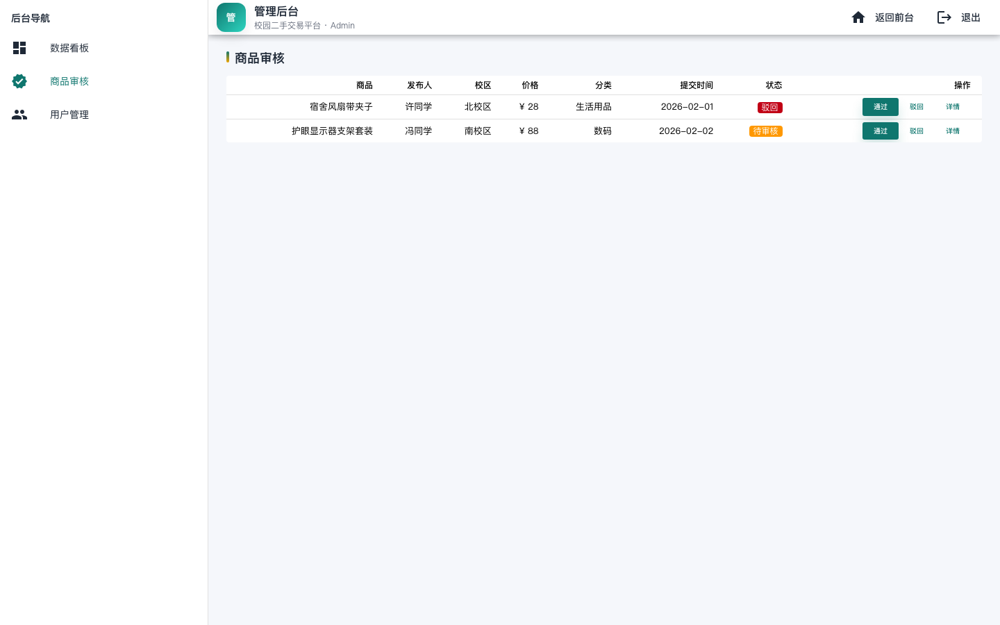

# 基于Quasar框架的校园二手交易平台设计与实现*
全智恒1, 郑伊轮1  
1(苏州城市学院 计算科学与人工智能学院, 江苏 苏州 215000)  
通讯作者: 郑伊轮, E-mail: <请填写>

摘  要: 校园二手交易是典型的高频、低客单、强时效场景. 现有线下与社交群交易方式在信息组织、交易可信和过程追溯方面存在明显缺陷, 导致资源匹配效率低、交易纠纷成本高. 本文面向高校“同校实名、轻量交易、快速流转”的业务特点, 设计并实现了一套基于Quasar框架的校园二手交易平台. 系统采用前后端分离架构, 前端以Quasar+Vue3构建多端一致交互, 后端以RESTful接口驱动业务逻辑, 数据层采用MySQL关系模型实现交易信息持久化与审计可追溯. 在方法上, 本文围绕“用户-商品-订单-消息-审核”五类核心对象建立状态机与数据约束, 重点解决了商品审核闭环、订单状态流转一致性、会话唯一性建模等工程问题. 在实现上, 完成了学生端（登录、搜索、详情、发布、订单、消息）与管理端（看板、审核、用户治理）的关键功能. 在验证上, 采用功能测试与流程回归相结合的方法对核心链路进行评估, 结果表明系统能够稳定支撑“发布-审核-下单-沟通-成交”全过程, 具备后续部署与扩展基础.

关键词: 校园二手交易; Quasar; Vue3; 软件工程; MySQL; 状态机

中图法分类号: TP311

中文引用格式: 全智恒, 郑伊轮. 基于Quasar框架的校园二手交易平台设计与实现. 软件工程毕业论文, 2026.  
英文引用格式: Quan ZH, Zheng YL. Design and implementation of a campus second-hand trading platform based on Quasar framework. Undergraduate thesis, 2026.

---

# Design and Implementation of Campus Second-hand Trading Platform Based on Quasar Framework
QUAN Zhi-Heng1, ZHENG Yi-Lun1  
1(School of Computer Science and Artificial Intelligence, Suzhou City University, Suzhou 215000, China)

Abstract: Campus second-hand trading is characterized by high frequency, low transaction amount, and strong timeliness. Existing offline markets and chat-group transactions suffer from fragmented information, weak trust assurance, and poor process traceability. To address these issues, this paper designs and implements a campus second-hand trading platform based on Quasar. The system follows a front-end/back-end separated architecture. The front-end is implemented with Quasar and Vue3 for consistent multi-device interaction, while RESTful services and a MySQL relational schema are used for business orchestration and persistent storage. A state-machine-oriented model is introduced for five core entities: user, listing, order, conversation, and review. The design focuses on review-loop closure, order transition consistency, and conversation uniqueness constraints. The implemented prototype covers both student side (login, search, listing detail, publishing, order management, and messaging) and admin side (dashboard, listing review, and user governance). Functional and regression tests on core workflows demonstrate that the system can reliably support the full pipeline from listing submission to transaction completion, with good extensibility for future deployment.

Key words: campus second-hand trading; Quasar; Vue3; software engineering; MySQL; state machine

---

## 1 引言
校园闲置物资交易在高校场景中长期存在真实需求. 与综合电商相比, 校园场景具备两个差异化特征:  
1) 用户关系具有半熟人属性, 对实名认证和信用展示敏感;  
2) 交易多发生在同校短半径范围内, 物流链路短但时效要求高.

然而, 当前常见的QQ群、微信群、论坛帖交易方式仍属于“弱结构化信息交换”:  
1) 商品信息格式不统一, 可检索性差;  
2) 缺乏统一审核机制, 不良信息难治理;  
3) 交易状态无法追踪, 纠纷处置成本高.

围绕上述问题, 本文以软件工程方法完成平台从需求分析、架构设计、数据库建模到系统实现与测试的完整过程, 目标是形成可演示、可扩展、可工程化落地的校园交易系统.

### 1.1 研究目标
本文目标可归纳为以下三点:
1. 构建覆盖前台交易与后台治理的完整业务闭环.  
2. 设计满足一致性约束的数据模型与状态流转机制.  
3. 提供可直接进入后端联调与部署阶段的工程文档与实现基础.

### 1.2 主要贡献
本文的主要贡献如下:
1. 提出面向校园交易场景的五对象状态建模方法（用户、商品、订单、会话、审核）.  
2. 给出可执行的MySQL数据库设计, 含12张核心表及索引策略.  
3. 实现并验证“发布-审核-下单-沟通-成交”端到端流程, 输出可复用开发路线.

---

## 2 需求分析与问题定义
### 2.1 角色定义
系统角色分为学生用户与管理员:
1. 学生用户: 浏览、搜索、发布、收藏、下单、沟通、查看订单.  
2. 管理员: 商品审核、用户状态管理、平台数据看板查看.

### 2.2 业务约束
根据场景抽象, 系统需满足以下约束:
1. 商品发布后必须经过审核才可上架.  
2. 一个商品可对应多个下单尝试, 但成交后需立即停止可售状态.  
3. 会话需在“商品+买家+卖家”维度唯一, 防止重复会话分裂历史消息.  
4. 管理员禁用用户后, 该用户在售商品应联动下架.

### 2.3 核心业务流程

图1 系统总体架构图

图2 交易与审核核心流程图

图2展示了本文实现的主流程. 其中审核分支和订单分支均纳入状态机约束:
1. 审核分支: `待审核 -> 上架` 或 `待审核 -> 驳回 -> 修改后重提`.  
2. 订单分支: `待确认 -> 已确认/进行中 -> 已完成` 或终止态 `已取消/已拒绝`.

---

## 3 系统设计
### 3.1 总体架构
系统采用三层逻辑:
1. 表现层: Quasar页面与组件, 覆盖学生端与管理端.  
2. 服务层: 认证、商品、订单、消息、审核等RESTful服务.  
3. 数据层: MySQL关系数据库与索引体系.

架构选择理由:
1. 前后端分离降低耦合, 便于并行开发与后续部署演进.  
2. 关系型数据库便于保证交易一致性与审计可追溯.  
3. 状态枚举和日志表可显著降低联调期“状态漂移”风险.

### 3.2 关键状态模型
设商品状态集合为:
\[
S_L = \\{0:\\text{草稿},1:\\text{待审核},2:\\text{上架},3:\\text{已售},4:\\text{下架},5:\\text{驳回}\\}
\]
设订单状态集合为:
\[
S_O = \\{0:\\text{待确认},1:\\text{已确认},2:\\text{进行中},3:\\text{已完成},4:\\text{已取消},5:\\text{已拒绝}\\}
\]
系统只允许有限状态迁移函数 \(\delta\) 的合法边执行, 并在每次迁移后写入日志表 `ct_order_status_log`.

### 3.3 检索与推荐策略
前端热度排序采用可解释线性评分:
\[
score(i)=\\alpha\\cdot like(i)+\\beta\\cdot view(i)
\]
其中 \(\alpha\) 和 \(\beta\) 为经验权重, 在当前实现中取 \(\alpha=1,\beta=0.1\).  
该策略具备实现成本低、可解释性强、便于后续A/B实验的优点.

---

## 4 数据库设计
### 4.1 E-R建模

图3 数据库E-R概念图

核心实体及关系:
1. 用户(`ct_user`) 1:N 商品(`ct_listing`).  
2. 商品 1:N 图片(`ct_listing_image`).  
3. 用户 N:M 商品（通过收藏表 `ct_favorite`）.  
4. 商品 1:N 订单(`ct_order`).  
5. 会话(`ct_conversation`) 1:N 消息(`ct_message`).  
6. 商品 1:N 审核记录(`ct_listing_review`).

### 4.2 关键数据表设计
表1给出核心表及其职责.

表1 核心数据表说明

| 表名 | 作用 | 关键字段 | 关键约束 |
| --- | --- | --- | --- |
| `ct_user` | 用户主表 | `user_id`,`role_type`,`user_status` | `student_no`唯一 |
| `ct_listing` | 商品主表 | `listing_id`,`seller_id`,`listing_status` | 卖家外键、状态枚举 |
| `ct_listing_image` | 商品图片 | `listing_id`,`is_cover`,`sort_no` | 同商品可多图 |
| `ct_order` | 订单主表 | `order_no`,`buyer_id`,`seller_id`,`order_status` | `order_no`唯一 |
| `ct_order_status_log` | 订单状态日志 | `order_id`,`from_status`,`to_status` | 强制审计留痕 |
| `ct_conversation` | 会话 | `listing_id`,`buyer_id`,`seller_id` | 三元组唯一 |
| `ct_message` | 消息 | `conversation_id`,`sender_id`,`message_body` | 会话外键 |
| `ct_listing_review` | 审核记录 | `listing_id`,`reviewer_id`,`review_result` | 审核过程可追溯 |

### 4.3 索引策略
围绕高频查询构建索引:
1. 商品检索: `category+status`,`campus+status`,`price`.  
2. 订单列表: `buyer+status`,`seller+status`.  
3. 后台审核: `listing_status+created_at`.  
4. 消息拉取: `conversation_id+sent_at`.

---

## 5 系统实现
### 5.1 前台模块实现
系统前台覆盖登录、首页、检索、详情、发布、个人中心、消息中心等页面.

图4 前台首页界面

首页实现了校园热卖展示、分类入口与认证引导, 支持快速进入检索与发布路径.

图5 商品发布界面

发布页支持多图上传、主图设置、信息填写和预览, 并在提交后自动进入“待审核”状态.

### 5.2 管理后台实现

图6 商品审核界面

审核页提供待审列表、详情查看、通过/驳回操作, 驳回状态可回流至卖家编辑重提.

图7 管理看板界面

看板统计活跃用户、待审核商品、成交订单和累计成交额, 为治理策略提供数据依据.

### 5.3 接口设计与联调策略
接口按资源组织, 示例:
1. 认证: `POST /api/v1/auth/login`.  
2. 商品: `GET/POST/PATCH /api/v1/listings`.  
3. 订单: `POST /api/v1/orders`, `PATCH /api/v1/orders/{id}/status`.  
4. 消息: `GET/POST /api/v1/conversations/{id}/messages`.

联调原则:
1. 状态字段数据库存数值枚举, API层转换前端显示值.  
2. 时间统一ISO8601输出.  
3. 列表统一分页结构 `{list,page,pageSize,total}`.

---

## 6 实验与结果分析
### 6.1 测试设计
测试分为三类:
1. 功能正确性测试: 逐页面验证核心功能.  
2. 流程回归测试: 验证跨页面业务闭环.  
3. 状态一致性测试: 验证状态机与数据库约束一致.

### 6.2 关键测试结果
表2 核心功能测试结果

| 编号 | 测试项 | 预期 | 结果 |
| --- | --- | --- | --- |
| T1 | 正常用户登录 | 登录成功并进入首页 | 通过 |
| T2 | 禁用用户登录 | 阻断登录并提示 | 通过 |
| T3 | 商品发布 | 进入待审核状态 | 通过 |
| T4 | 管理员审核通过 | 商品状态变更为上架 | 通过 |
| T5 | 买家下单 | 生成订单且状态待确认 | 通过 |
| T6 | 卖家确认后买家收货 | 状态迁移至已完成 | 通过 |
| T7 | 会话发送消息 | 消息正确写入与展示 | 通过 |
| T8 | 管理员禁用用户 | 关联在售商品自动下架 | 通过 |

### 6.3 结果讨论
测试结果说明:
1. 核心链路已具备稳定闭环能力.  
2. 状态约束可有效避免非法操作引发的数据不一致.  
3. 后续瓶颈主要在并发场景与真实部署的性能优化, 而非业务模型本身.

---

## 7 威胁与局限
1. 当前版本尚未接入真实支付与物流体系, 成交链路为校园场景简化模型.  
2. 消息模块为轻量会话实现, 未覆盖离线推送和已读回执高级能力.  
3. 压测与安全测试（如越权、注入、XSS）尚需在后端落地后系统开展.

---

## 8 结论
本文完成了一个面向高校场景的二手交易平台设计与实现, 在架构、数据建模、状态机制和关键功能上形成了可复用工程方案. 相比非结构化社群交易方式, 所设计系统在信息组织、流程闭环和治理能力方面更具优势. 结合已完成数据库DDL与接口路线图, 该系统可直接进入后端实现与部署阶段, 并可在此基础上继续扩展支付、风控、评价和推荐能力.

---

## 参考文献
[1] 郑建华, 霍仁崇, 甘秀娜. 校园二手商品交易平台的设计与实现[J]. 计算机光盘软件与应用, 2012(09):183-184.  
[2] 缑堡. 基于MVC的校园二手商品交易系统设计与实现[D]. 沈阳: 东北大学, 2015.  
[3] 刘彦昌. 二手书交易平台的设计与实现[D]. 北京: 北京邮电大学, 2018.  
[4] 韩嘉锐. 基于JavaWeb的高校二手交易平台管理系统设计与实现[J]. 机电技术应用, 2019(01):159.  
[5] 陈聪飞, 郝东来. 基于B/S架构的二手交易平台设计与实现[J]. 电子制作, 2021(01):52-54.  
[6] 肖林, 倪敏. 二手图书交易平台的设计与实现[J]. 信息与电脑(理论版), 2021,33(07):137-139.  
[7] YUAN J, ZHANG Y, WANG Y. Research on design and implementation of campus second-hand platform based on WeChat mini program[J]. Advances in Computer, Signals and Systems, 2024,8:113-118.  
[8] ZHONG X, YAO R, QIAO R, et al. Intelligent campus second-hand trading platform based on microservices and cloud computing[J]. Frontiers in Sustainable Development, 2024,4(6):165-177.  
[9] QUASAR FRAMEWORK. Quasar Framework Documentation[EB/OL]. [2026-02-28]. https://quasar.dev/.  
[10] Vue.js Team. Vue 3 Official Documentation[EB/OL]. [2026-02-28]. https://vuejs.org/.  
[11] MySQL Team. MySQL 8.0 Reference Manual[EB/OL]. [2026-02-28]. https://dev.mysql.com/doc/.  
[12] Fielding R T. Architectural styles and the design of network-based software architectures[D]. University of California, Irvine, 2000.  
[13] 张海藩. 软件工程导论[M]. 北京: 清华大学出版社, 2018.  
[14] Sommerville I. Software Engineering[M]. 10th ed. Boston: Pearson, 2015.  
[15] 王珊, 萨师煊. 数据库系统概论[M]. 北京: 高等教育出版社, 2019.

---

## 附录A 图表清单
1. 图1 系统总体架构图  
2. 图2 交易与审核核心流程图  
3. 图3 数据库E-R概念图  
4. 图4 前台首页界面  
5. 图5 商品发布界面  
6. 图6 商品审核界面  
7. 图7 管理看板界面

---

\* 基金项目: 本科毕业设计（校园二手交易平台方向）  
\* 收稿日期: 2026-02-28; 修改日期: 2026-02-28; 采用日期: 2026-02-28（课程论文阶段）  
