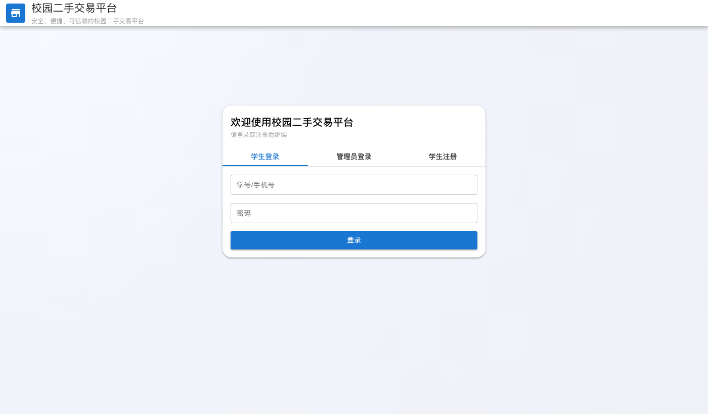
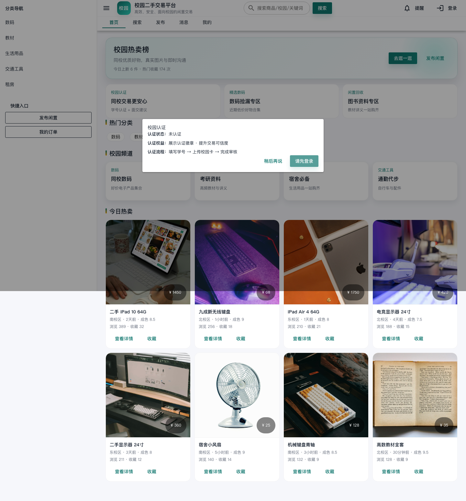
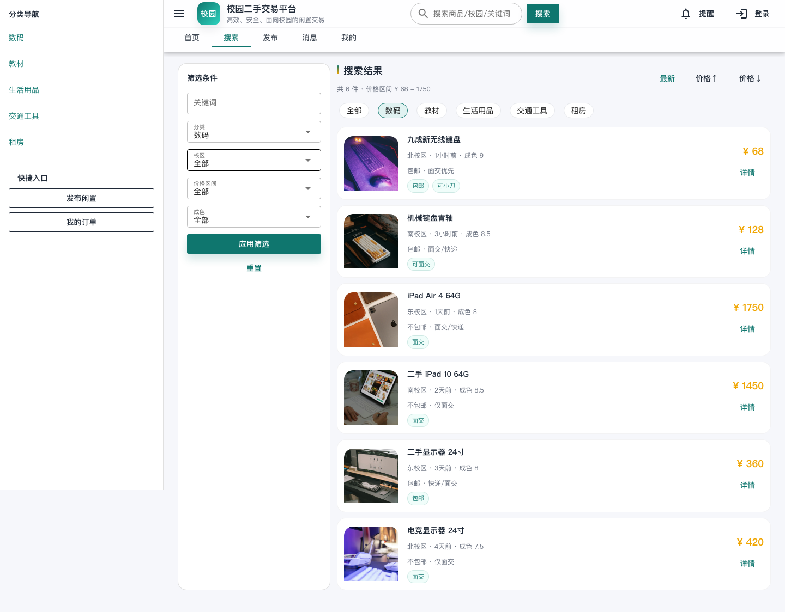
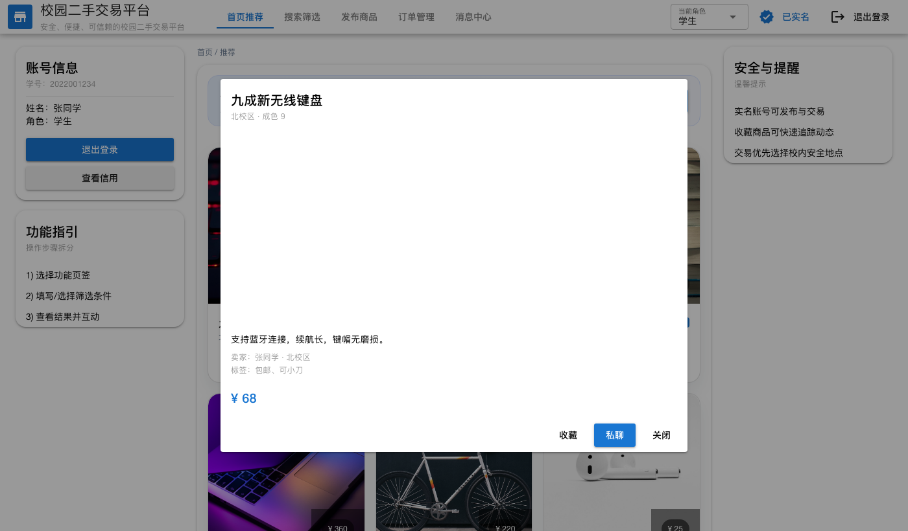
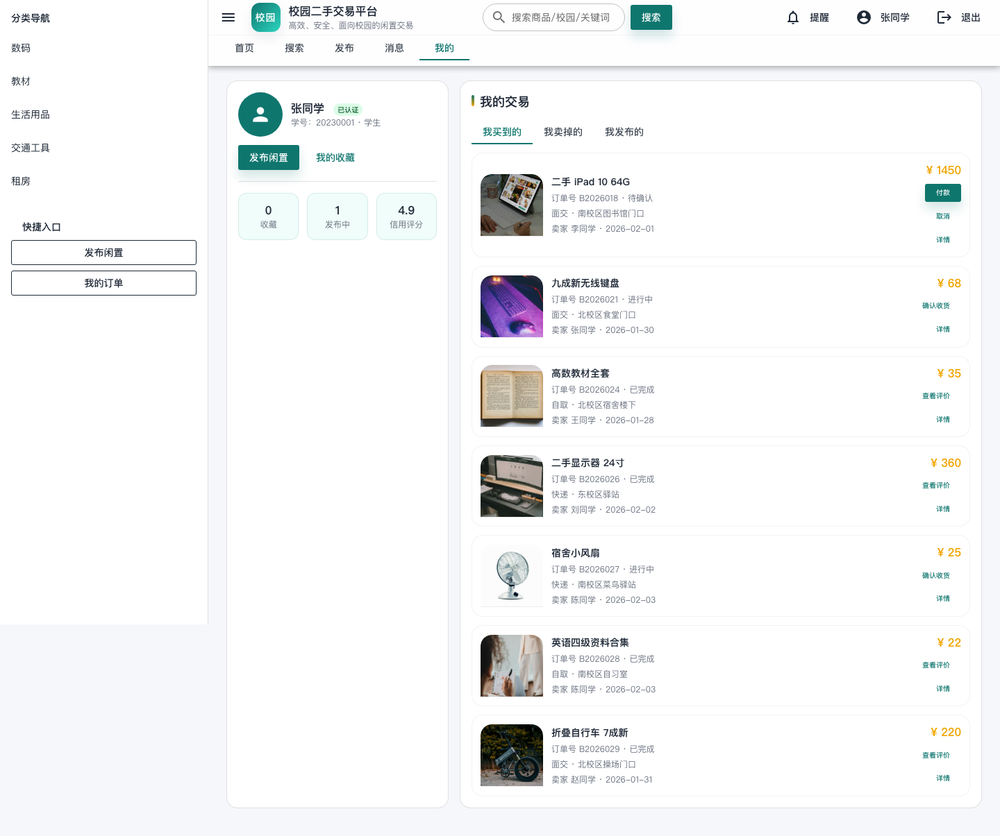
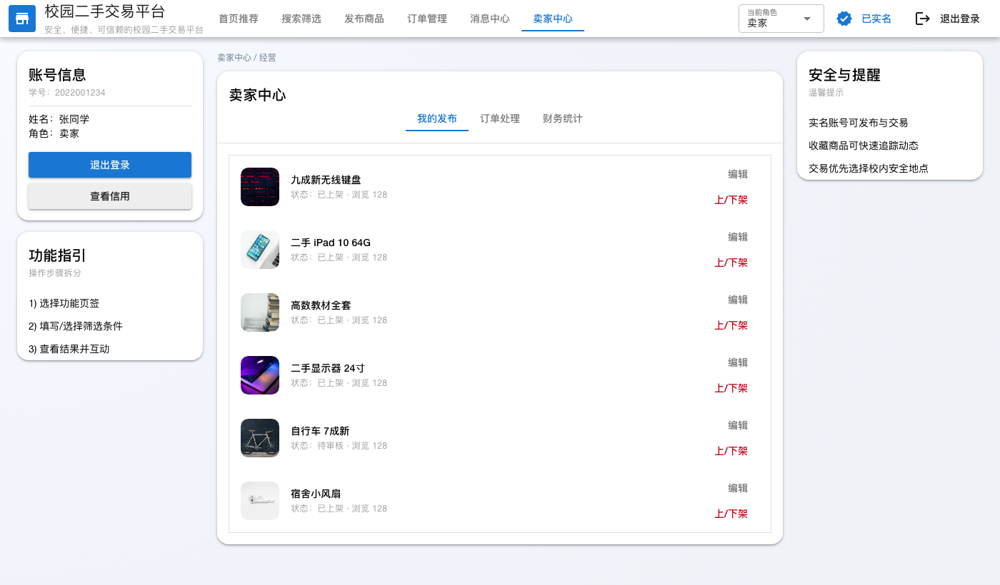
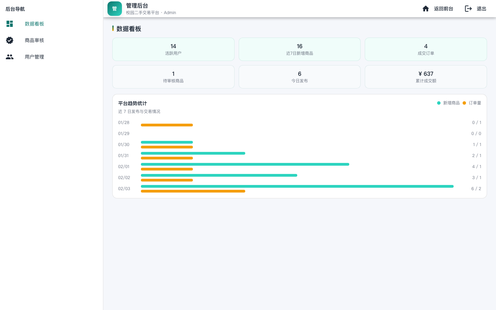

# 校园二手交易平台阶段性汇报（前端）

> 汇报时长：约 5 分钟（≈ 900-1200 字）  
> 汇报范围：前端静态演示（无后端，固定测试数据）

## 一、本期完成内容（30s）
1. 保持 Quasar UMD 方案，免构建、双击 `index.html` 即可运行展示。
2. 学生账号默认具备“买家 + 卖家”身份，统一入口完成交易与发布。
3. 首页与详情使用真实商品图片（本地相对路径加载，避免 `file://` 失效）。
4. 完整前端交互链路：搜索筛选、发布商品、订单管理、消息、卖家中心、管理后台。
5. 订单/审核/私聊等状态更新可交互演示，统一 UI 风格与信息层级。

## 二、核心功能与互动点（40s）
- 登录/注册/管理员登录
- 首页推荐与分类浏览
- 搜索筛选：关键词、分类、校区、价格、成色、排序
- 商品详情：多图切换、收藏、私聊入口
- 订单管理：待确认 → 进行中 → 已完成 / 已取消
- 消息中心：聊天列表与对话消息发送
- 卖家中心：商品管理、订单处理、财务统计
- 管理后台：数据看板、商品审核、订单管理、用户管理、结算

## 三、关键页面截图 + 讲解指引（约 3 分钟）
### 1) 登录界面（学生/管理员）

讲解指引：
- 强调“学生登录 + 管理员登录”入口并列，适合演示与答辩切换。
- 学生登录后默认具备买卖身份，不需要再切换角色。

### 2) 首页推荐（真实图片展示）

讲解指引：
- 首页推荐展示真实图片，解决 `file://` 资源无法加载的问题。
- 点击卡片可进入详情，体现“浏览 → 详情”的完整路径。

### 3) 搜索筛选页（多条件筛选）

讲解指引：
- 展示关键词、分类、校区、价格、成色与排序。
- 强调“应用筛选 / 重置”可交互演示。

### 4) 商品详情页（多图切换 + 互动入口）

讲解指引：
- 展示主图与缩略图切换，强调真实图片与名称一致。
- 收藏与私聊入口可触发后续互动演示。

### 5) 订单管理（买家视角）

讲解指引：
- 演示订单状态流转：待确认 → 进行中 → 已完成 / 已取消。
- 强调前端逻辑已具备，后端接入即可真实落地。

### 6) 卖家中心（我的发布）

讲解指引：
- 学生默认具备卖家中心入口，可编辑/下架商品。
- 展示浏览量与状态，体现运营数据的基本信息结构。

### 7) 管理后台（数据看板）

讲解指引：
- 看板展示活跃用户、新增商品与成交订单。
- 后续可继续扩展审核、订单处理与用户管理模块。

## 四、当前限制（20s）
1. 仅前端静态演示，未接入真实后端接口。
2. 支付、物流、评价、举报等业务链路尚未接入。
3. 图片上传与裁剪仅为演示，未做真实文件管理。

## 五、下一步计划（30s）
1. 对接后端：商品、用户、订单、消息数据持久化。
2. 补充支付/评价/举报等关键流程。
3. 优化移动端适配与性能体验。

---

## 汇报稿（约 5 分钟，可直接照读）
各位老师好，我是本次项目的前端负责同学。接下来我用 5 分钟介绍校园二手交易平台的前端实现与演示效果。

首先是本期完成内容。我们保持 Quasar UMD 方案，整个项目无需构建，双击 `index.html` 就能直接运行，便于答辩和现场演示。学生账号默认具备“买家 + 卖家”身份，进入系统后无需切换角色即可完成交易与发布。首页与详情均使用真实商品图片，并采用相对路径加载，避免 `file://` 打开图片丢失的问题。同时，已完成搜索筛选、发布、订单管理、消息、卖家中心与管理后台等交互模块，整体 UI 风格统一。

接下来是功能演示与截图讲解。  
第一张是登录界面，同时支持学生登录与管理员登录，便于切换到后台演示；学生登录后即拥有买卖能力。  
第二张是首页推荐区，展示真实图片与价格、成色等信息，点击卡片可以进入详情，形成“浏览 → 详情”的路径。  
第三张是搜索筛选页，可按关键词、分类、校区、价格、成色和排序进行筛选，并支持一键重置。  
第四张是商品详情页，支持主图与缩略图切换，收藏与私聊入口可以触发后续互动演示。  
第五张是订单管理页，包含待确认、进行中、已完成和取消等状态，前端已实现状态流转逻辑。  
第六张是卖家中心，学生默认具备入口，可查看我的发布、编辑或下架商品。  
第七张是管理后台数据看板，用于展示平台整体运行指标，后续可继续扩展商品审核、订单处理与用户管理。

最后说明当前限制与下一步计划。当前版本为前端静态演示，尚未接入真实后端接口，支付、物流、评价等流程尚未完成。下一步将对接后端数据，补齐交易闭环流程，并优化移动端体验。

我的汇报到这里，谢谢各位老师。
