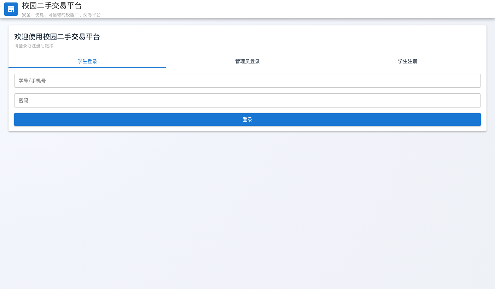
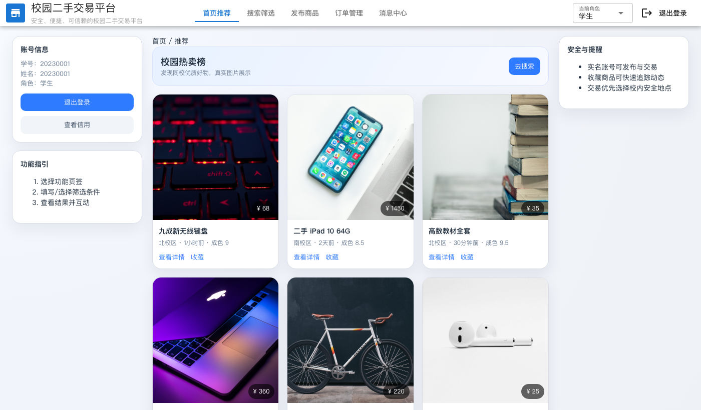
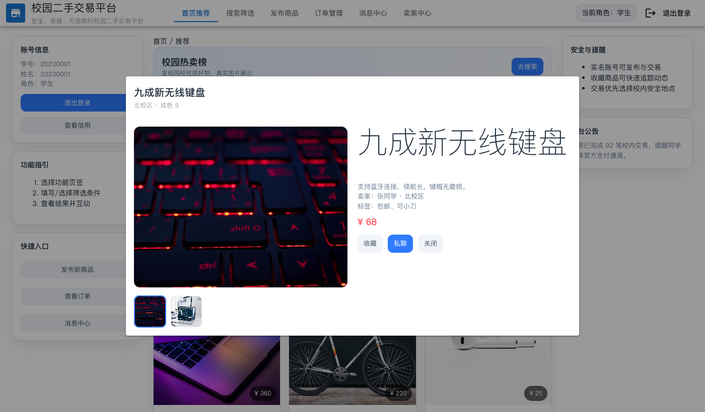

# 校园二手交易平台阶段性汇报（前端）

## 一、本周完成内容
1. 保持 Quasar 框架结构，完成前端静态页面的整体布局与交互。
2. 首页商品卡片支持真实图片展示，解决本地 `file://` 打开时图片不显示的问题（改为相对路径加载本地资源）。
3. 实现登录/注册/管理员登录的前端交互流程（无后端，使用固定测试数据）。
4. 商品详情弹窗支持主图+缩略图切换展示。
5. UI 统一风格优化：信息卡片、按钮、网格布局、页面留白与层级。

## 二、已实现功能清单（前端交互）
- 登录/注册/管理员登录切换
- 角色切换（学生/卖家/管理员）
- 首页推荐商品列表展示
- 商品详情弹窗（图片、价格、描述、标签、操作按钮）
- 商品收藏按钮的交互入口（占位逻辑）
- 私聊按钮入口（占位逻辑）

## 三、效果截图
### 1) 登录界面

### 2) 首页商品展示

### 3) 商品详情弹窗

## 四、当前已知问题
1. 仅前端静态演示，尚未接入真实后端数据。
2. 订单/消息/卖家中心/管理后台等页面还未细化模块化交互。
3. 部分按钮仅为入口占位，未绑定完整业务流程。

## 五、下周优化计划
1. 根据说明书补齐各功能模块页面与交互（订单、消息、卖家中心、管理后台）。
2. 增加筛选搜索、发布商品、订单状态流转等完整交互链路。
3. 补充页面响应式布局优化，适配不同分辨率。
4. 若允许接入后端，将商品/用户/订单数据改为动态加载。
